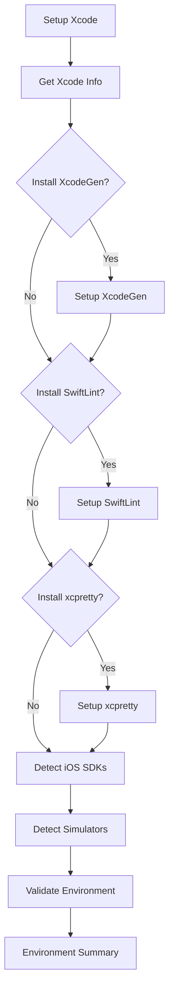

# Setup iOS Environment Action

A comprehensive GitHub Action for setting up a complete iOS development environment with Xcode, XcodeGen, SwiftLint, and other essential tools.

## Features

- 🍎 **Xcode Configuration**: Automated Xcode version setup
- 🔧 **XcodeGen Integration**: Seamless project generation
- 🧹 **SwiftLint Support**: Optional code quality tooling
- 💎 **xcpretty Integration**: Formatted build output
- 📱 **Environment Detection**: iOS SDKs and simulator discovery
- ✅ **Validation**: Comprehensive environment verification
- 🚀 **Performance Optimized**: Intelligent caching and installation strategies

## Usage

### Basic Usage

```yaml
- name: Setup iOS Environment
  uses: ./.github/actions/setup-ios-environment
```

### Advanced Configuration

```yaml
- name: Setup iOS Environment with all tools
  uses: ./.github/actions/setup-ios-environment
  with:
    xcode-version: '16.0'
    install-xcodegen: 'true'
    xcodegen-version: 'latest'
    install-swiftlint: 'true'
    install-xcpretty: 'true'
    generate-project: 'true'
    cache-key-suffix: 'full-env'
```

### Minimal Setup (Xcode only)

```yaml
- name: Setup iOS Environment (Xcode only)
  uses: ./.github/actions/setup-ios-environment
  with:
    install-xcodegen: 'false'
    install-swiftlint: 'false'
    install-xcpretty: 'false'
```

### Using Outputs

```yaml
- name: Setup iOS Environment
  id: ios-env
  uses: ./.github/actions/setup-ios-environment
  with:
    install-swiftlint: 'true'

- name: Display environment info
  run: |
    echo "Xcode Version: ${{ steps.ios-env.outputs.xcode-version }}"
    echo "XcodeGen Version: ${{ steps.ios-env.outputs.xcodegen-version }}"
    echo "SwiftLint Version: ${{ steps.ios-env.outputs.swiftlint-version }}"
    echo "iOS SDKs: ${{ steps.ios-env.outputs.ios-sdks }}"
    echo "Environment Ready: ${{ steps.ios-env.outputs.environment-ready }}"
```

## Inputs

| Input | Description | Required | Default |
|-------|-------------|----------|---------|
| `xcode-version` | Xcode version to use | No | `16.0` |
| `install-xcodegen` | Whether to install XcodeGen | No | `true` |
| `xcodegen-version` | XcodeGen version to install | No | `latest` |
| `install-swiftlint` | Whether to install SwiftLint | No | `false` |
| `install-xcpretty` | Whether to install xcpretty | No | `false` |
| `generate-project` | Whether to generate Xcode project | No | `true` |
| `cache-key-suffix` | Custom suffix for cache keys | No | `''` |

### Input Details

#### `xcode-version`
- Supports any version available in GitHub Actions runners
- Common versions: `16.0`, `15.4`, `15.2`
- Uses `maxim-lobanov/setup-xcode` action internally

#### `install-xcodegen`
- Set to `false` if your project doesn't use XcodeGen
- When `true`, uses the `setup-xcodegen` action internally
- Respects `xcodegen-version` and `generate-project` settings

#### `install-swiftlint`
- Installs SwiftLint via Homebrew with architecture detection
- ARM64 optimized installation for Apple Silicon runners
- Includes verification and error handling

#### `install-xcpretty`
- Installs xcpretty gem for formatted Xcode build output
- Useful for CI/CD pipelines with readable build logs
- Lightweight installation via RubyGems

#### `generate-project`
- Only applies when `install-xcodegen` is `true`
- Requires `project.yml` in repository root
- Set to `false` if you only need XcodeGen installed

## Outputs

| Output | Description |
|--------|-------------|
| `xcode-version` | The configured Xcode version |
| `xcodegen-version` | The installed XcodeGen version (if installed) |
| `swiftlint-version` | The installed SwiftLint version (if installed) |
| `ios-sdks` | Available iOS SDKs (JSON array) |
| `simulators` | Available simulators (JSON array) |
| `environment-ready` | Whether the environment is ready for development |

### Output Examples

#### `ios-sdks`
```json
["17.0", "16.4", "16.2"]
```

#### `simulators`
```json
["iPhone 15 Pro", "iPhone 15", "iPhone 14 Pro", "iPhone 14", "iPhone 13"]
```

#### `environment-ready`
- `true`: All requested tools are installed and verified
- `false`: One or more tools failed installation or verification

## Architecture

This action orchestrates multiple setup steps:



## Tool Installation Strategies

### XcodeGen
- Uses the `setup-xcodegen` action internally
- Supports caching and multiple installation methods
- See [setup-xcodegen documentation](../setup-xcodegen/README.md) for details

### SwiftLint
- **ARM64 Homebrew**: Optimized for Apple Silicon (`arch -arm64 brew`)
- **Standard Homebrew**: Fallback for Intel runners
- **Verification**: Confirms installation and version detection

### xcpretty
- **RubyGems Installation**: `gem install xcpretty --no-document`
- **Pre-installation Check**: Skips if already available
- **Verification**: Confirms command availability

## Environment Detection

### iOS SDKs
- Detects all available iOS SDKs via `xcodebuild -showsdks`
- Returns as JSON array for easy parsing
- Example: `["17.0", "16.4", "16.2"]`

### Simulators
- Detects available iPhone simulators
- Returns top 5 simulators as JSON array
- Filters for available devices only

## Validation

The action performs comprehensive environment validation:

### Required Tools
- ✅ Xcode (`xcodebuild` command)
- ✅ XcodeGen (if `install-xcodegen: true`)
- ✅ SwiftLint (if `install-swiftlint: true`)
- ✅ xcpretty (if `install-xcpretty: true`)

### Validation Process
1. Check each requested tool availability
2. Count validation errors
3. Set `environment-ready` output accordingly
4. Fail the action if any required tool is missing

## Performance

### Typical Setup Times
- **Xcode only**: ~10-20 seconds
- **+ XcodeGen (cached)**: +5-10 seconds
- **+ XcodeGen (fresh)**: +30-60 seconds
- **+ SwiftLint**: +1-3 minutes
- **+ xcpretty**: +10-30 seconds

### Optimization Features
- **Parallel tool detection**: SDKs and simulators detected simultaneously
- **Smart caching**: XcodeGen caching reduces repeated installations
- **Architecture optimization**: ARM64-specific installation paths
- **Pre-installation checks**: Skip installation if tools already available

## Examples

### CI Pipeline Setup
```yaml
name: iOS CI

jobs:
  test:
    runs-on: macos-latest
    steps:
      - uses: actions/checkout@v4
      
      - name: Setup iOS Environment
        uses: ./.github/actions/setup-ios-environment
        with:
          install-swiftlint: 'true'
          install-xcpretty: 'true'
      
      - name: Run Tests
        run: |
          xcodebuild test \
            -project MyApp.xcodeproj \
            -scheme MyApp \
            -destination 'platform=iOS Simulator,name=iPhone 15 Pro' \
            | xcpretty
```

### Release Build Setup
```yaml
- name: Setup iOS Environment for Release
  uses: ./.github/actions/setup-ios-environment
  with:
    xcode-version: '16.0'
    install-xcodegen: 'true'
    install-swiftlint: 'false'  # Skip for release builds
    install-xcpretty: 'true'
    cache-key-suffix: 'release'
```

### Matrix Build with Different Configurations
```yaml
strategy:
  matrix:
    include:
      - name: "Unit Tests"
        install-swiftlint: true
        install-xcpretty: true
      - name: "UI Tests"
        install-swiftlint: false
        install-xcpretty: true
      - name: "Release Build"
        install-swiftlint: false
        install-xcpretty: false

steps:
  - name: Setup iOS Environment
    uses: ./.github/actions/setup-ios-environment
    with:
      install-swiftlint: ${{ matrix.install-swiftlint }}
      install-xcpretty: ${{ matrix.install-xcpretty }}
      cache-key-suffix: ${{ matrix.name }}
```

## Troubleshooting

### Common Issues

#### "Environment validation failed"
- Check which specific tool failed in the validation step
- Ensure network connectivity for tool downloads
- Verify Homebrew is available for SwiftLint installation

#### "XcodeGen installation failed"
- See [setup-xcodegen troubleshooting](../setup-xcodegen/README.md#troubleshooting)
- Check if `project.yml` exists for project generation

#### "SwiftLint installation failed"
- Ensure Homebrew is installed and functional
- Check GitHub rate limits if using Homebrew
- Try with `install-swiftlint: false` as workaround

#### "No iOS SDKs detected"
- Verify Xcode installation completed successfully
- Check Xcode command line tools are properly configured
- Ensure runner has sufficient permissions

### Debug Information

The action provides detailed logging for each step:
- Tool installation progress and methods used
- Environment detection results
- Validation step details
- Comprehensive summary with all versions and status

## Contributing

When modifying this action:

1. Test with different tool combinations
2. Verify cross-platform compatibility (ARM64/Intel)
3. Update documentation for new inputs/outputs
4. Test error handling scenarios
5. Validate performance impact of changes
6. Ensure backward compatibility with existing workflows

## Dependencies

This action depends on:
- [`maxim-lobanov/setup-xcode`](https://github.com/maxim-lobanov/setup-xcode) - Xcode setup
- [`setup-xcodegen`](../setup-xcodegen/) - XcodeGen installation (internal)
- Homebrew - SwiftLint installation
- RubyGems - xcpretty installation

## License

This action is part of the Crown & Barrel iOS project and follows the same licensing terms.
