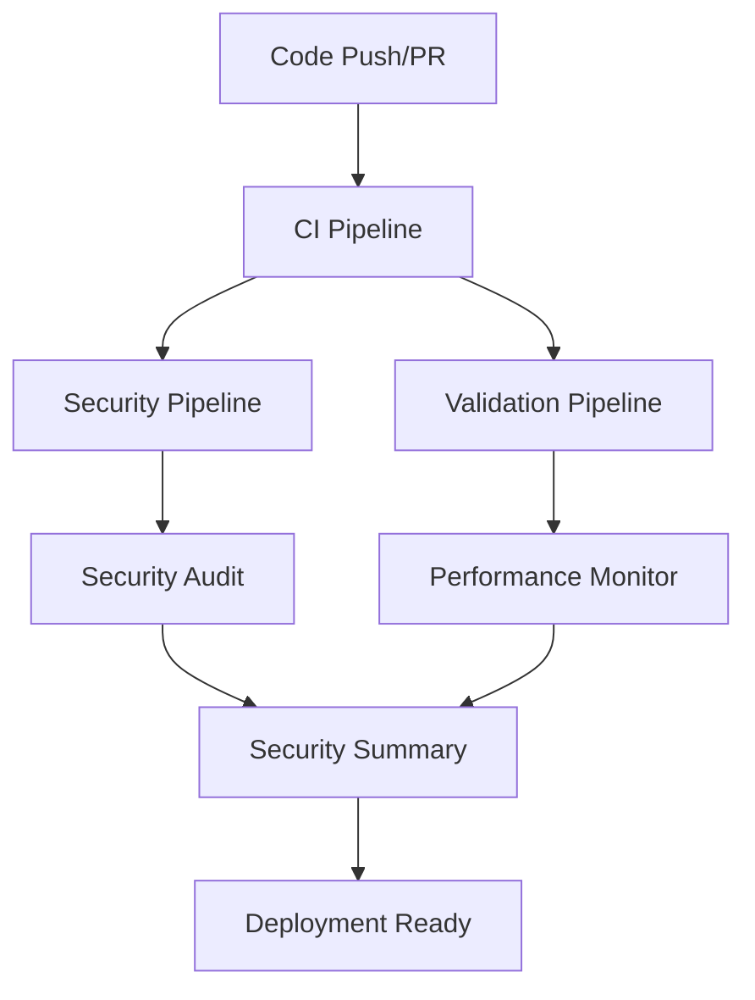

# Crown & Barrel iOS - CI/CD Pipeline Documentation

## Overview

This document provides comprehensive documentation for the Crown & Barrel iOS application's CI/CD pipeline. The pipeline consists of 8 GitHub Actions workflows that handle continuous integration, security auditing, performance monitoring, and deployment.

## Table of Contents

- [Pipeline Architecture](#pipeline-architecture)
- [Workflow Overview](#workflow-overview)
- [Security Pipeline](#security-pipeline)
- [Troubleshooting Guide](#troubleshooting-guide)
- [Validation Procedures](#validation-procedures)
- [Maintenance Procedures](#maintenance-procedures)
- [Common Issues & Solutions](#common-issues--solutions)

## Pipeline Architecture

### High-Level Architecture



### Workflow Relationships

- **Trigger Workflows**: `ci.yml`, `ios-ci.yml`
- **Security Workflows**: `security.yml`, `security-audit.yml`
- **Validation Workflows**: `validate.yml`, `performance-monitor.yml`
- **Deployment Workflows**: `release.yml`, `dependency-update.yml`

## Workflow Overview

### 1. CI Pipeline (`ci.yml`)
- **Purpose**: Main continuous integration pipeline
- **Triggers**: Push to main, pull requests
- **Runs On**: macOS latest
- **Key Features**:
  - iOS build and test
  - Code quality checks (SwiftLint)
  - Dependency validation
  - Performance testing

### 2. iOS CI Fast Feedback (`ios-ci.yml`)
- **Purpose**: Fast feedback for iOS development
- **Triggers**: Push to main, pull requests (with path filters)
- **Runs On**: macOS latest
- **Key Features**:
  - Essential tests only
  - Fast execution
  - Path-based triggering

### 3. Security Pipeline (`security.yml`)
- **Purpose**: Security scanning and vulnerability assessment
- **Triggers**: Push to main/develop, weekly schedule
- **Runs On**: macOS latest, Ubuntu latest
- **Key Features**:
  - CodeQL analysis
  - Dependency vulnerability scanning
  - Secret scanning (TruffleHog)
  - License compliance checking

### 4. Security Audit (`security-audit.yml`)
- **Purpose**: Comprehensive security auditing
- **Triggers**: Weekly schedule, manual dispatch
- **Runs On**: macOS latest, Ubuntu latest
- **Key Features**:
  - Static analysis (Semgrep)
  - Dependency security scanning
  - Secret detection
  - Security policy validation

### 5. Validation Pipeline (`validate.yml`)
- **Purpose**: Code quality and compliance validation
- **Triggers**: Push to main, pull requests
- **Runs On**: macOS latest, Ubuntu latest
- **Key Features**:
  - Build validation
  - Security validation
  - Performance validation
  - Compliance checking

### 6. Performance Monitor (`performance-monitor.yml`)
- **Purpose**: Performance monitoring and optimization
- **Triggers**: Push to main, weekly schedule
- **Runs On**: macOS latest
- **Key Features**:
  - Build performance tracking
  - Memory usage analysis
  - Test execution time monitoring

### 7. Release Pipeline (`release.yml`)
- **Purpose**: Automated release management
- **Triggers**: Tags, manual dispatch
- **Runs On**: macOS latest
- **Key Features**:
  - Build distribution
  - App Store preparation
  - Release notes generation

### 8. Dependency Update (`dependency-update.yml`)
- **Purpose**: Automated dependency management
- **Triggers**: Weekly schedule, manual dispatch
- **Runs On**: macOS latest, Ubuntu latest
- **Key Features**:
  - SPM dependency updates
  - Homebrew dependency updates
  - Security vulnerability checks

## Security Pipeline

### Configuration

The security pipeline uses multiple tools with comprehensive error handling:

#### Permissions
```yaml
permissions:
  actions: read
  contents: read
  security-events: write
  packages: read
```

#### Security Tools
- **CodeQL**: Static analysis for security vulnerabilities
- **Trivy**: Vulnerability scanner for dependencies and filesystems
- **TruffleHog**: Secret detection and scanning
- **Semgrep**: Static analysis for security issues

#### Error Handling
All security tools are configured with `continue-on-error: true` to prevent pipeline failures while still reporting issues.

### Critical Security Fixes Applied

1. **SARIF Upload Permissions**: Added workflow-level `security-events: write` permission
2. **TruffleHog Configuration**: Changed to filesystem scan mode to avoid git commit comparison issues
3. **Comprehensive Error Handling**: Added `continue-on-error` to all security tools
4. **Action Version Compatibility**: Using stable, tested versions of all actions

## Troubleshooting Guide

### Common Issues

#### 1. SARIF Upload Failures
**Error**: "Resource not accessible by integration"
**Solution**: Ensure workflow-level permissions include `security-events: write`

#### 2. TruffleHog BASE/HEAD Errors
**Error**: "BASE and HEAD commits are the same"
**Solution**: Use filesystem scan mode with `extra_args: --debug --only-verified filesystem`

#### 3. Python Environment Issues
**Error**: "externally-managed-environment"
**Solution**: Use `pipx` instead of `pip` for tool installation

#### 4. Action Version Issues
**Error**: "Unable to resolve action"
**Solution**: Use stable, tested versions (e.g., `trivy-action@0.32.0`)

### Validation Script

Use the comprehensive validation script to test workflows before deployment:

```bash
./test_security_pipeline.sh
```

This script validates:
- YAML syntax
- Security tool configuration
- Action versions
- Error handling setup

## Validation Procedures

### Pre-Deployment Validation

1. **YAML Syntax Check**
   ```bash
   python3 -c "import yaml; yaml.safe_load(open('.github/workflows/workflow.yml'))"
   ```

2. **Security Pipeline Test**
   ```bash
   ./test_security_pipeline.sh
   ```

3. **Workflow Structure Validation**
   ```bash
   # Check for required fields
   grep -q "name:" .github/workflows/*.yml
   grep -q "on:" .github/workflows/*.yml
   grep -q "jobs:" .github/workflows/*.yml
   ```

### Local Testing

1. **Syntax Validation**: All workflow files must pass YAML validation
2. **Structure Validation**: All workflows must have required fields (name, on, jobs)
3. **Security Validation**: Security tools must have proper error handling
4. **Version Validation**: All actions must use stable, tested versions

## Maintenance Procedures

### Regular Maintenance Tasks

1. **Weekly Security Audits**: Automated via `security-audit.yml`
2. **Dependency Updates**: Automated via `dependency-update.yml`
3. **Performance Monitoring**: Automated via `performance-monitor.yml`

### Manual Maintenance

1. **Action Version Updates**: Review and update action versions monthly
2. **Security Tool Updates**: Keep security tools updated for latest vulnerability detection
3. **Workflow Optimization**: Review and optimize workflow performance quarterly

### Emergency Procedures

1. **Security Pipeline Failures**: Use `continue-on-error` configuration to prevent blocking
2. **Build Failures**: Check Xcode and iOS simulator versions
3. **Permission Issues**: Verify workflow-level permissions are correctly set

## Common Issues & Solutions

### Build Issues

| Issue | Cause | Solution |
|-------|-------|----------|
| Xcode version not found | Unsupported Xcode version | Use `latest-stable` |
| iOS simulator not available | Unsupported iOS version | Use supported iOS versions (18.2, 18.1, 17.5) |
| Build timeout | Resource constraints | Optimize build configuration |

### Security Issues

| Issue | Cause | Solution |
|-------|-------|----------|
| SARIF upload fails | Missing permissions | Add `security-events: write` |
| TruffleHog fails | Git commit comparison | Use filesystem scan mode |
| Python tool fails | Environment conflicts | Use `pipx` for isolation |

### Performance Issues

| Issue | Cause | Solution |
|-------|-------|----------|
| Slow builds | Inefficient caching | Optimize cache configuration |
| Test timeouts | Resource constraints | Parallelize test execution |
| Memory issues | Large dependencies | Optimize dependency management |

## Best Practices

### Security
- Always use `continue-on-error: true` for security tools
- Maintain proper permissions at workflow level
- Use stable, tested versions of security tools
- Regular security audits and updates

### Performance
- Use appropriate caching strategies
- Parallelize independent jobs
- Monitor build times and optimize accordingly
- Use efficient trigger conditions

### Maintenance
- Document all changes and their rationale
- Test changes locally before deployment
- Use comprehensive validation scripts
- Maintain clear troubleshooting documentation

## Support

For CI/CD pipeline issues:
1. Check this documentation first
2. Run validation scripts
3. Review workflow logs
4. Consult troubleshooting guide
5. Contact DevOps team for complex issues

---

*Last Updated: $(date)*
*Pipeline Version: 2.0*
*Documentation Version: 1.0*
