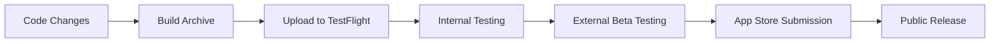

# Crown & Barrel Deployment Documentation

Complete guide for deploying Crown & Barrel to TestFlight and the App Store.

## 🚀 **TestFlight Deployment**

### **Complete Setup Guide**
- [`TESTFLIGHT_PREPARATION_PROJECT_PLAN.md`](TESTFLIGHT_PREPARATION_PROJECT_PLAN.md) - **START HERE** - Complete step-by-step TestFlight setup

### **Content & Marketing**
- [`APP_STORE_CONTENT.md`](APP_STORE_CONTENT.md) - App Store listing content (description, keywords, etc.)
- [`TESTFLIGHT_CONTENT.md`](TESTFLIGHT_CONTENT.md) - TestFlight beta testing content
- [`SCREENSHOT_PLANNING_GUIDE.md`](SCREENSHOT_PLANNING_GUIDE.md) - App Store screenshot strategy

## 📱 **Deployment Status**

### **✅ Completed**
- [x] Apple Developer Portal configuration
- [x] App Store Connect app record creation
- [x] Code signing setup (automatic)
- [x] First build upload to TestFlight
- [x] Internal testing configuration
- [x] TestFlight beta app setup

### **🎯 Current Status**
- **TestFlight**: ✅ **LIVE** - Internal testing active
- **App Store**: ⏳ **Pending** - Ready for submission when desired

### **📋 Next Steps (Optional)**
1. **External Beta Testing** - Add external testers to TestFlight
2. **Beta App Review** - Submit for external tester approval (24-48 hours)
3. **Public Release** - Submit to App Store when ready

## 🛠️ **Build Configuration**

Build configurations are stored in [`../../build-config/`](../../build-config/):

- `exportOptions-automatic.plist` - TestFlight/App Store Connect upload
- `exportOptions-appstore.plist` - App Store distribution
- `exportOptions-testflight.plist` - TestFlight specific configuration

## 📧 **Key Information**

### **App Details**
- **Bundle ID**: `com.crownandbarrel.app`
- **Team ID**: `G7Z5DDPMSL`
- **App Name**: Crown & Barrel
- **Subtitle**: Digital Watch Collection Manager

### **Distribution Methods**
- **TestFlight**: Active internal testing
- **App Store**: Ready for submission
- **Development**: Local testing builds

## 🎯 **Deployment Workflow**

## 📞 **Support**

For deployment issues:
1. Check [`../CI_CD_TROUBLESHOOTING.md`](../CI_CD_TROUBLESHOOTING.md)
2. Review Apple Developer documentation
3. Verify code signing certificates in Keychain Access

---

**Current Status**: 🎉 **TestFlight Live** - Ready for beta testing!

*Last updated: September 2025*
